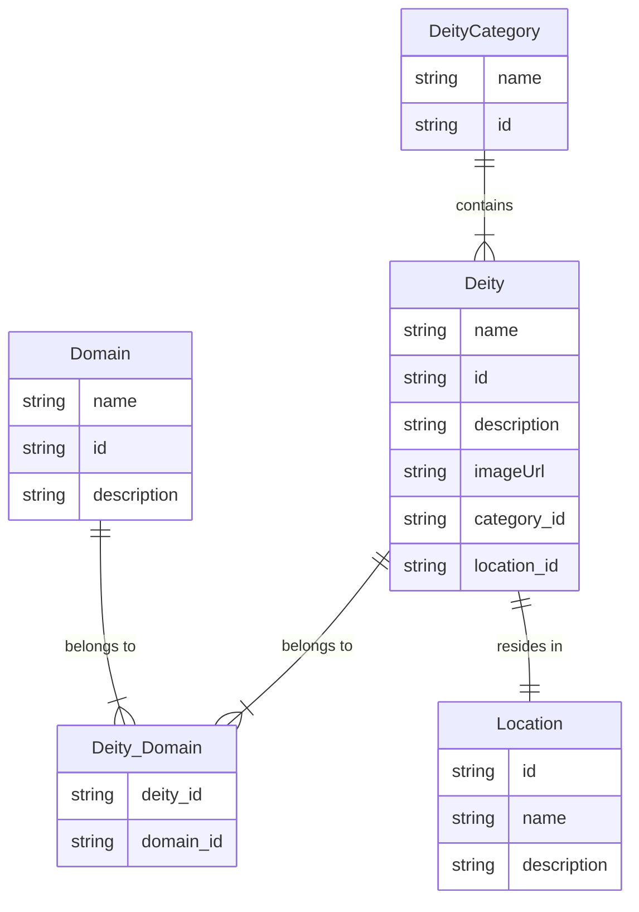

# db-migrations

This "library" is used by the kysely-cli to run migrations for the database on
deploys to production. There is a watchman process watching for this image's
updates.

## Database Design

