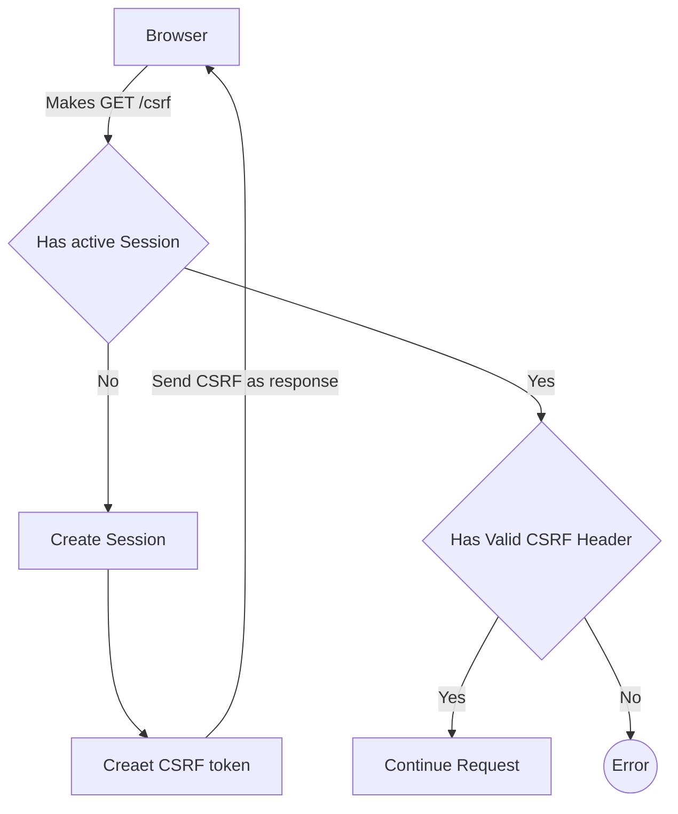

# server-csrf

This library was generated with [Nx](https://nx.dev).

## Running unit tests

Run `nx test server-csrf` to execute the unit tests via [Jest](https://jestjs.io).

## Flow of CSRF Requests

